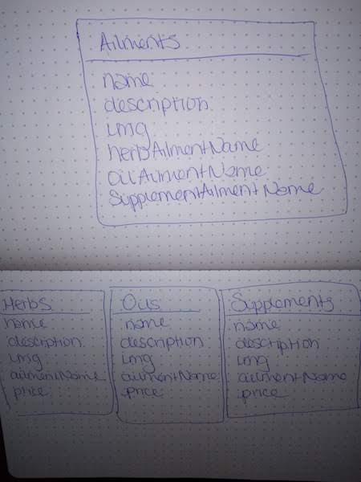

# Overview
At Drea's Medicinal Herb Shop, we strive to give the best quality herbs and also helpful suggestions to alleviate any ailment you or your loved one may have.
  

# Trello & Heroku
[Trello Board](https://trello.com/b/immpbyRT/sei-project-2)
 
[Deployed Heroku App](https://serene-peak-93613.herokuapp.com/)

# Wireframes

# References Used
[Starwest Botanicals](https://www.starwest-botanicals.com/)  
[Mountain Rose Herbs](https://www.mountainroseherbs.com/)  
[The Herb Shop](https://bulkherbshop.com/) 
[Aromatherapy](http://www.aromatherapy.com/most_popular.html)  

# Technologies Used
<!-- HTML5   -->
CSS3  
jQuery  
Handlebars  
Express  
MongoDB  
Mongoose  

# Next Version
- Functioning Shopping Cart
- A page where you can click on the ailment or benefit and all the herbs, essential oils, and supplements that helps with that will appear.
